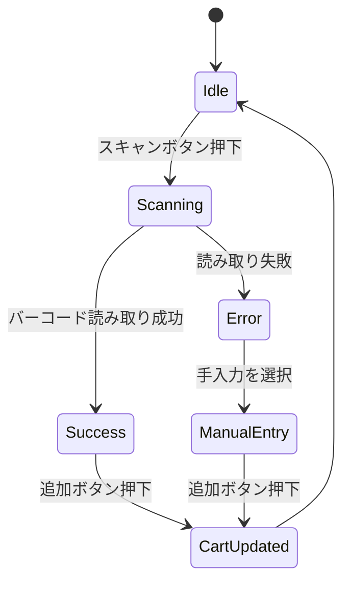

# UI仕様書 v1.0

参照元: `reference/スクリーンショット (2401).png`
更新日: 2025-10-27
担当: Codex

## 1. 画面一覧
- ログイン画面（PIN入力）
- 会計画面（スキャン＋カート）※本ドキュメントでは会計画面Lv2デザインを詳細化
- 決済確認ダイアログ
- 取引完了画面
- 取引履歴モーダル

## 2. 会計画面 UI 詳細
### 2.1 レイアウトグリッド
- 12カラム（各カラム幅 72px、ガター16px）
- ヘッダー高さ 64px、フッター 72px
- メインコンテンツ高さは端末解像度 - 136px を基準（タブレット縦1024px想定）

### 2.2 セクション構成
1. **バーコードスキャンセクション**
   - コンポーネントID: `scanner-section`
   - 要素: スキャンボタン、結果コード、商品名、単価
   - 背景: `#E8F0FE`
   - スキャンボタンスタイル: 高さ72px、角丸8px、背景`#3A7BD5`、ホバー`#1862C6`、文字色`#FFFFFF`
   - ステータス表示: `scanning`/`success`/`error`をアイコンとトーストで表示

2. **追加アクションエリア**
   - コンポーネントID: `add-to-cart`
   - "追加"ボタンはプライマリボタン（高さ56px、幅カラム8つ分）
   - フォールバック入力フィールド: バーコード手入力、数量入力（デフォルト1）

3. **購入リスト（カート）**
   - コンポーネントID: `cart-list`
   - 表示要素: 行番号、商品名、単価、数量、小計
   - 各行右端に削除/編集ボタン（アイコンサイズ24px）
   - 小計、税額、合計をフッターボックスで表示（背景`#F7F9FC`）

4. **購入ボタンエリア**
   - コンポーネントID: `checkout-bar`
   - ボタン幅: 全幅、背景`#2E7D32`、ホバー`#1B5E20`
   - サブテキスト: 合計額（税込/税抜）を2段表示、右揃え

### 2.3 状態遷移

### 2.4 バリデーション
| 項目 | ルール | エラー表示 |
| --- | --- | --- |
| バーコード | 数字/英字 8〜13桁、未入力不可 | `バーコードを確認してください`（赤ラベル） |
| 数量 | 1〜999、整数 | `数量は1〜999で入力` |
| メールアドレス（完了画面） | RFC準拠、任意 | `メール形式が正しくありません` |

### 2.5 トースト/ダイアログ
- 成功: 緑 (#388E3C)、アイコン`check-circle`
- エラー: 赤 (#D32F2F)、アイコン`error`
- マネージャー承認ダイアログ: PINフィールド＋承認/却下ボタン

## 3. カラーパレット
| 用途 | Color | Hex |
| --- | --- | --- |
| プライマリ | POS Blue | #0051A2 |
| セカンダリ | Slate Gray | #4F5B62 |
| 成功 | Forest Green | #2E7D32 |
| エラー | Crimson | #C62828 |
| 背景 | Off White | #F5F7FA |

## 4. タイポグラフィ
- 見出し: `Noto Sans JP` Bold 24px
- 本文: `Noto Sans JP` Regular 16px
- ボタン: `Noto Sans JP` Medium 18px
- 数値表示: `Roboto Mono` 18px

## 5. アイコンセット
- マテリアルアイコンベース、Outlinedスタイル
- 使用予定: `qr_code_scanner`, `delete_outline`, `edit`, `sync_problem`, `cloud_done`

## 6. レスポンシブ仕様
- ブレークポイント: 768px (ハンディ), 1024px (タブレット)
- ハンディ表示時: カートは折りたたみ、合計バー固定表示
- 横向き時: スキャンエリアとカートを2カラム並列表示

## 7. インタラクション詳細
- スキャン完了時、商品名エリアに1.5秒間ハイライト（背景#FFF9C4）
- 追加ボタン押下時、カートにスライドインアニメーション（200ms）
- 購入ボタン押下で決済確認ダイアログをモーダル表示

## 8. アクセシビリティ対応
- カラーコントラスト比 4.5:1 以上（プライマリボタンは白文字でコントラスト確保）
- キーボード操作: `Tab`順序はスキャン→バーコード→数量→追加→カート一覧→購入
- スクリーンリーダー: 主要ボタンに `aria-label` 付与、ライブリージョンで合計更新を通知

## 9. 未決事項
- ログイン画面のブランドロゴ（デザインチーム検討中）
- Englishローカリゼーションの文言レビュー
- オフライン時の警告バナーアイコン（素材選定）

---
本ドキュメントは初期ドラフトです。Figmaリンク作成後、参照URLを追記予定。
